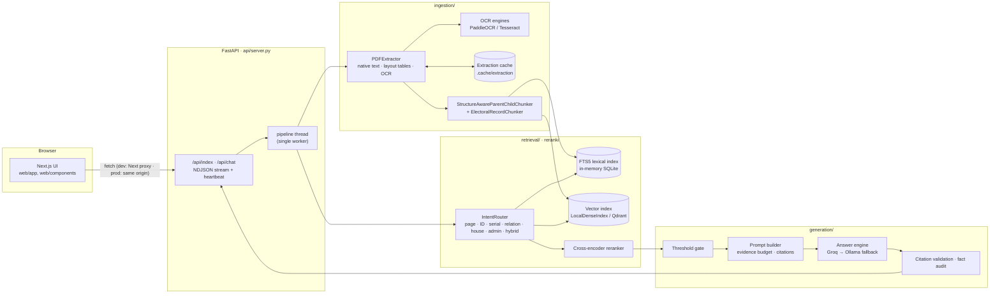
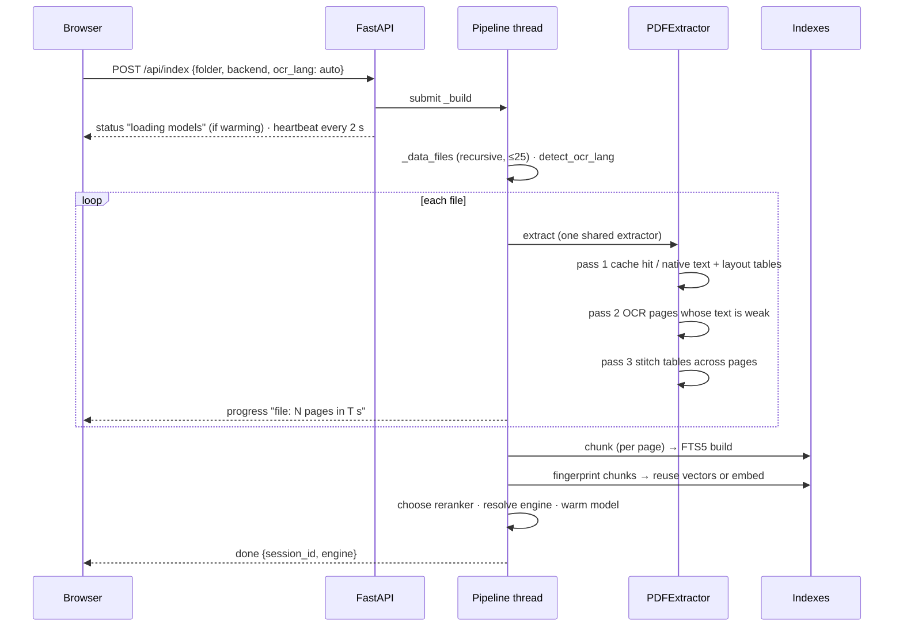
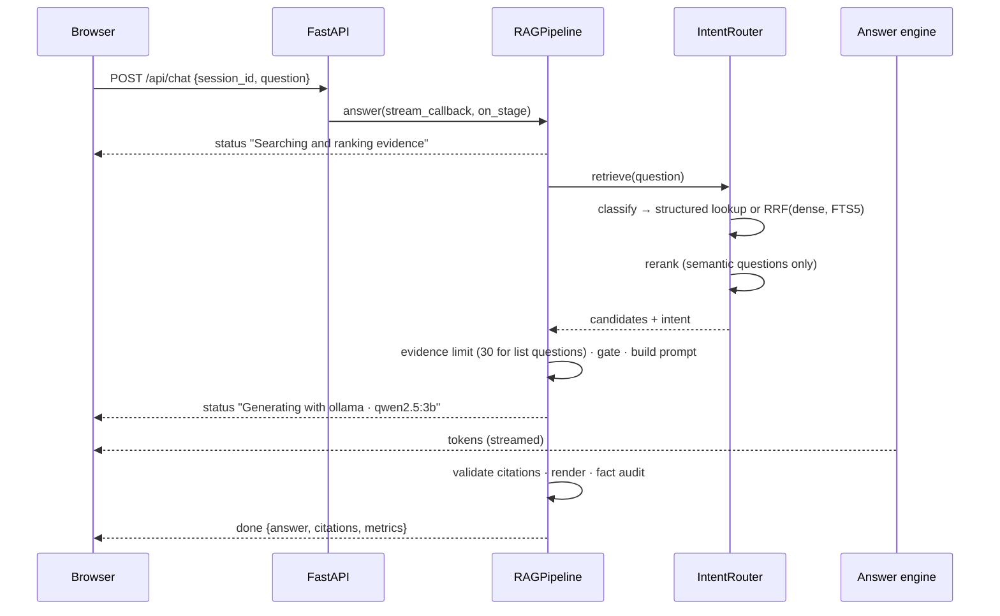

# Sanchay RAG — Architecture Report

Sanchay answers questions over a folder of documents and cites the page each
claim came from. The same pipeline has to serve three very different corpora:

| Corpus | Nature | Hard part |
|---|---|---|
| Patna Master Plan 2031 (`pmp-2031-report.pdf`, 335 pp.) | Digital PDF, many tables | Tables split across pages; numeric lookups |
| Bihar electoral rolls (`data/183/*.pdf`, 435 files × ~28 pp.) | Scanned Hindi, 3-column voter cards | OCR; per-voter records; exhaustive lists ("which voters…") |
| Research papers | Digital prose | Semantic questions over sections |

Everything runs locally except (optionally) the answer engine.

---

## 1. Component map



| Layer | Module | Responsibility |
|---|---|---|
| UI | `web/app/page.tsx`, `web/components/*`, `web/rag/client.ts` | Folder picker, engine picker, index progress, streamed answers, citations, per-stage timings |
| API | `api/server.py` | Streams NDJSON; heartbeats; cancel on disconnect; model warm-up; sessions; serves the exported UI |
| Orchestration | `ask.py` (`load_file`, `make_extractor`, `build_pipeline`, `resolve_llm`, `detect_ocr_lang`) | Shared by CLI and API |
| Extraction | `ingestion/pdf_extractor.py`, `ingestion/ocr.py`, `ingestion/layout.py`, `ingestion/preprocess.py`, `ingestion/cache.py` | Native-first extraction, OCR fallback, table recovery and stitching, content-addressed page cache |
| Chunking | `ingestion/chunking.py`, `ingestion/electoral.py` | Parent/child chunks for tables and prose; one record per voter grouped by household |
| Lexical search | `retrieval/fts5_index.py` | BM25 over FTS5, slash-safe IDs, field search, fuzzy EPIC match |
| Dense search | `retrieval/local_dense.py`, `retrieval/dense.py`, `retrieval/embedder.py` | multilingual-e5-small embeddings; NumPy index on disk, Qdrant when a server is available |
| Routing | `retrieval/router.py`, `retrieval/rrf.py` | Intent classification, structured lookups, RRF fusion |
| Reranking | `rerank/cross_encoder.py` | ms-marco MiniLM (English) or mMiniLM (multilingual) |
| Generation | `generation/pipeline.py`, `prompts.py`, `llm.py`, `citations.py`, `abstention.py`, `audit.py` | Gate, prompt packing, streaming engines, citation checks |

---

## 2. Request lifecycles

### 2.1 Indexing a folder



### 2.2 Answering a question



If the browser disconnects, the next `emit` raises inside the worker, so
generation stops at the next token and the single pipeline thread is freed.

---

## 3. Data model and storage

| Type | Fields that matter | Where |
|---|---|---|
| `Document` | `doc_id = "<file stem>#p<page>"`, `title`, `page`, `metadata` (extraction method, OCR confidence, stitched tables) | per page, in memory |
| `Chunk` | `chunk_id`, `doc_id`, `text`, `page`, `metadata.parent_id / parent_text / block_type` | FTS5 rows and vector payloads |
| `ScoredChunk` | `chunk`, `score`, `rank` | retrieval results |

| Store | Path | Contents | Invalidated by |
|---|---|---|---|
| Extraction cache | `.cache/extraction/<xx>/<sha>.json` | page text + metadata | file bytes, page, every extraction setting, `CACHE_VERSION` |
| Vector index | `.cache/vectors/<collection>/` | float16 vectors + JSONL payloads | chunk-text fingerprint (`.cache/index_manifests/`) |
| Lexical index | in memory | FTS5 over chunk text | rebuilt per index (seconds) |

Parent/child chunking: the child (a table row batch, ~200 words of prose, or one
voter card) is what gets searched; the parent (the whole table, a ≤500-word
section, or the whole household) is what the model reads.

---

## 4. Retrieval: the intent router

| Intent | Example | Strategy | Reranked? |
|---|---|---|---|
| Page lookup | "What is on page 66 of the master plan?" | Direct page fetch, filtered to the named document | No |
| Exact entity | "voter ID SHS5124394" | FTS5 exact → prefix → OCR-tolerant Levenshtein | No |
| Serial | "details of serial 1088" | FTS5 phrase `Serial: n` | No |
| Relation | "which voters have father name Md Zahid Khan" | Field search with dual-script synonyms; up to 30 records | No |
| House | "who lives in house S/0" | Field search on house codes (Latin/Devanagari digits) | No |
| Admin | "polling station name, total voters" | Page 1 + summary table | No |
| Exhaustive / hybrid | anything else | RRF(k=60) of dense and FTS5 | Yes |

---

## 5. Generation

- **Gate**: a threshold on the top score before any model call; abstaining skips
  the slowest stage.
- **Prompt**: numbered evidence (`[1]…`), labelled with document and page when
  it spans documents; packed to a token budget estimated per script (Devanagari
  and Urdu cost ~0.5 token per character).
- **Budgets**: CPU engines get the local preset (≤3 evidence chunks, 1,200
  tokens, 2,000 for list questions); hosted engines 6 chunks / 2,500 tokens.
- **Engines**: Groq when a key is set (Ollama behind it as fallback), otherwise
  the preferred installed Ollama model. Ollama is sent an explicit `num_ctx`.
- **Checks**: citations must point at supplied evidence; numbers in the answer
  are checked against the evidence text.

---

## 6. What made the UI slow or silent, and what fixed it

| # | Cause | Fix |
|---|---|---|
| 1 | Next's rewrite proxy cut requests at 30 s; gzip buffered the stream | `compress: false`, 30-min proxy timeout; production UI served by FastAPI itself |
| 2 | One pipeline thread, no cancellation: abandoned answers blocked every later question | Cancel on disconnect; "waiting for earlier request" status |
| 3 | Imports and model loads (and a ~1 GB first download) inside the first request | Startup warm-up with `/api/health`; `scripts/prefetch_models.py` |
| 4 | `qdrant_client` import blocked (grpc) / embedded Qdrant locked per index | `LocalDenseIndex`; Qdrant only when a server answers |
| 5 | Ollama context never set (silent truncation); UI defaulted to any model | Explicit `num_ctx`; preferred fast models first; recommended engine |
| 6 | Server OCR: 1 worker, English for Hindi scans, top-level files only | OCR workers, shared language detection, recursive scan |
| 7 | One electoral page switched a whole folder to the voter-card chunker | Per-page structure-aware chunking |
| 8 | "page 66" mixed pages from every document | Router matches the named document |
| 9 | Silent time spent without feedback | Heartbeats; live stage + elapsed time; per-stage timings under answers |

---

## 7. Measured performance (i5-8265U, 4 cores, 16 GB, CPU only)

All numbers come from `eval/latency_probe.py` runs (raw files in
`docs/dissertation/data/`) or the component benchmarks noted.

| Measurement | Result |
|---|---|
| Embedding throughput, multilingual-e5-small, ~280-token chunks | 8–10 chunks/s |
| First index, research paper (18 pp., 83 chunks) | 59 s (38 s extraction, 16 s embedding) |
| First index, Master Plan (335 pp., 1,616 chunks) | 317 s (1 s extraction from cache, 316 s embedding) |
| Re-index of an unchanged folder | vectors reused (fingerprint match) |
| Reranking 15 candidates, English MiniLM-L6 | ~1.0 s |
| Reranking 15 candidates, multilingual mMiniLM-L12 (384 → 256 tokens) | 4.3 s → 2.2 s |
| Retrieval + rerank per question (stub engine) | 1.3–1.8 s (paper), 2.9–3.7 s (Master Plan, before reranker fix), 0.03 s (page lookup) |
| PaddleOCR 3.3.1 on Windows, MKLDNN off (bug workaround) | ~110 s per page |
| Retrieval + rerank per question after the reranker fix | 0.8–1.2 s (median ~1.0 s) |
| Ollama qwen2.5:3b prompt reading / output | ~29 tokens/s / ~6.5 tokens/s; identical prompt repeated: 0.17 s |
| Ollama qwen2.5:1.5b prompt reading / output | 51 tokens/s / 13.5 tokens/s — but answered 40% for a 55.04% fact |
| Answer latency with Ollama qwen2.5:3b (final) | median first token 31.6 s, complete answer 38.5 s |

### 7.1 Answer latency with a local model

Ten golden questions (5 research paper, 5 Master Plan) through the full API,
four prompt configurations:

| Run | Configuration | Median prompt | First token | Total | Factual answers |
|---|---|---|---|---|---|
| A | Original ten-rule prompt, 1,200-token evidence + parents | 1,230 | 34.4 s | 40.6 s | 8/10 |
| B | Compact prompt, 700 tokens, no parents | 864 | 31.9 s | 37.3 s | 6/10 |
| C | Compact prompt, 1,200 tokens + parents | 1,006 | 27.2 s | 31.0 s | 6/10 |
| D | C + "answer in sentences" rule (**final**) | 1,027 | 31.6 s | 38.5 s | 8/10 |

On this CPU the model reads ~29 prompt tokens/s, so evidence size sets the
wait; cutting it saved little and lost answers, and the compact prompt alone
produced citation-only replies until rule 1 required stating the fact. For
interactive speed use a hosted engine (Groq); the local model is the offline
fallback.

---

## 8. Running it

```bash
# once
ragenv311\Scripts\python scripts\prefetch_models.py
ollama pull qwen2.5:3b                     # local engine
# .env: GROQ_API_KEY=gsk_...               # optional fast engine

# production: one process, one port
cd web && corepack pnpm build && cd ..
ragenv311\Scripts\python -m uvicorn api.server:app --port 8000
# open http://127.0.0.1:8000

# development: hot-reloading UI on :3000, proxied to :8000
cd web && corepack pnpm dev
```

| Variable | Effect |
|---|---|
| `GROQ_API_KEY` | Enables Groq (default engine when set) |
| `OLLAMA_URL`, `OLLAMA_NUM_CTX`, `OLLAMA_KEEP_ALIVE` | Local engine location, starting context, residency |
| `RAG_VECTOR_STORE` | `local` / `qdrant` / `auto` |
| `QDRANT_URL` | Qdrant server, when used |
| `RAG_SKIP_WARMUP` | `1` skips model warm-up (tests) |
| `LLM_TIMEOUT` | Read timeout for model servers |

---

## 9. Known limitations

- **Abstention threshold is not calibrated.** Scores come from three scales
  (RRF, sigmoid-normalised cross-encoder, structural 1.0) and the default
  threshold (-2.0) never abstains on retrieved evidence.
- **OCR on this Windows laptop**: PaddlePaddle 3.3.1's oneDNN path fails
  (`ConvertPirAttribute2RuntimeAttribute not support`); without oneDNN a page
  takes 104–118 s. PaddlePaddle 3.0.0 conflicts with PyTorch's runtime
  (`WinError 127`, `shm.dll`). Tesseract is supported (binary found outside
  PATH, Hindi/Urdu data in `.cache/tessdata`) but needs a machine-wide install,
  which was not done here — so the scanned rolls were not measured on this
  machine. A missing engine is now reported as an error, not blank pages.
- **Embedding is CPU-bound** at 8–10 chunks/s; large folders take minutes on
  first index (then are reused).
- One request at a time: a long index delays chat (by design, reported in the UI).
